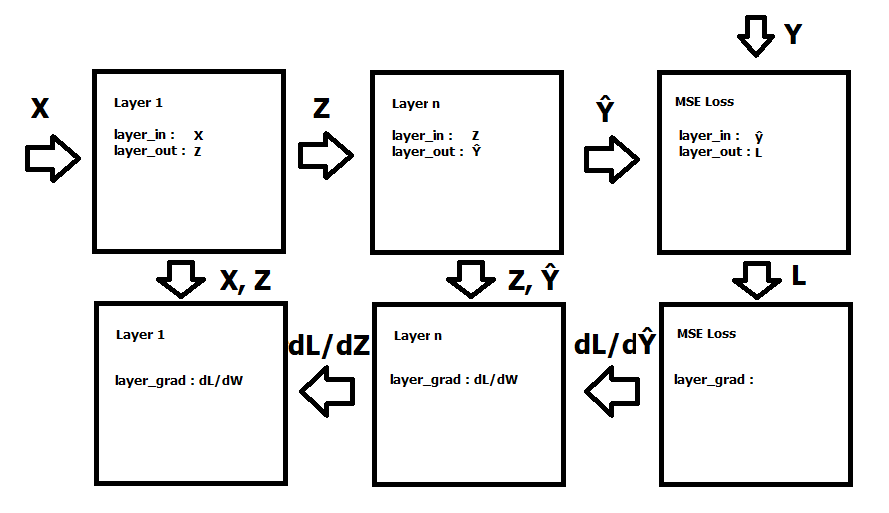
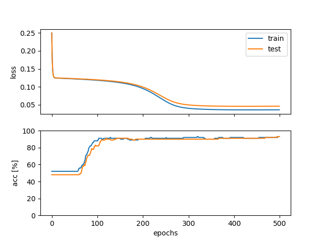

This a numpy based object-oriented implementation of a multilayer perceptron for deep learning basics course. 
The included data generator generates a data set with two gaussians distributions, which the model learns to classify.

A high level diagram of the backpropagation implementation.

Results of training the model.
